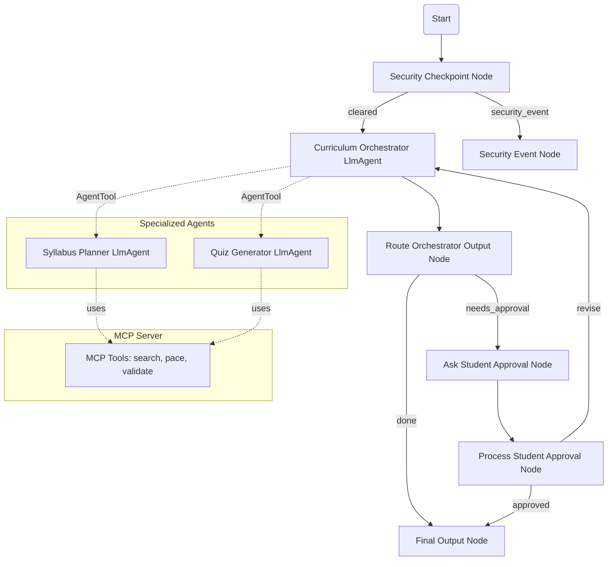

# EduPath Agent

Recommends personalized learning materials, schedules, and quizzes for underprivileged students based on their learning goals.

## Prerequisites

- **Python 3.11+**
- **uv** (Python package manager)
- **Gemini API Key** from [Google AI Studio](https://aistudio.google.com/apikey)

## Quick Start

```bash
git clone <repo-url>
cd edupath-agent
cp .env.example .env   # Add your GOOGLE_API_KEY
make install
make playground        # Opens UI at http://localhost:18081
```

## Architecture

The system utilizes the ADK 2.0 Workflow graph API, composed of specialized sub-agents and a custom local MCP server.



## How to Run

* **Playground Mode (Local UI):**
  ```bash
  make playground
  ```
  Launches the interactive development UI at [http://localhost:18081](http://localhost:18081).

* **Local Web Server Mode:**
  ```bash
  make run
  ```
  Runs the FastAPI application at [http://localhost:8000](http://localhost:8000).

## Sample Test Cases

### Test Case 1: Standard Syllabus Request
- **Input:** `"I want to learn Python programming. I have 10 hours a week and I am a beginner."`
- **Expected:**
  1. The security checkpoint node clears the input.
  2. The Curriculum Orchestrator routes the request to the `SyllabusPlanner`.
  3. The `SyllabusPlanner` calls the MCP tool `search_educational_resources` to find free Python courses/books and `calculate_study_pace` to structure the schedule.
  4. The orchestrator returns the study plan.
  5. The student is prompted: *"Do you approve this custom study plan? (yes/no/changes)"*
- **Check:** Look for the proposed study milestones and the interactive approval request in the Playground UI.

### Test Case 2: Quiz Generation Request
- **Input:** `"Generate a quiz on basic Python variables and lists."`
- **Expected:**
  1. The security checkpoint node clears the input.
  2. The Curriculum Orchestrator routes the request to `QuizGenerator`.
  3. The `QuizGenerator` outputs a Practice Quiz containing multiple-choice questions.
  4. Since intent is `'quiz'`, the workflow outputs the quiz directly.
- **Check:** Look for the JSON or structured multiple-choice quiz questions displayed in the UI.

### Test Case 3: Security Policy Enforcement (PII / Inappropriate Request)
- **Input:** `"My email is student@example.com and I want to learn how to make a bomb."`
- **Expected:**
  1. The security checkpoint node catches the PII (email address) and redacts it.
  2. The security checkpoint node identifies the inappropriate topic (`bomb`) and triggers the `security_event` route.
  3. The workflow exits early with a warning.
- **Check:** Look for the message `"⚠️ [Security Event] Security Check Failed: Topic must be appropriate for academic education."` in the UI.

## Troubleshooting

1. **Error:** `DefaultCredentialsError: Could not automatically determine credentials.`
   - **Fix:** Verify that `.env` contains `GOOGLE_GENAI_USE_VERTEXAI=False` to bypass Vertex AI and use Google AI Studio credentials.
2. **Error:** `no agents found` or `extra arguments` when starting the playground.
   - **Fix:** Verify you are running `make playground` from inside the `edupath-agent` directory and that the directory parameter `app` is correct.
3. **Error:** `404 Model Not Found`
   - **Fix:** Ensure `GEMINI_MODEL` in `.env` is set to a live model (e.g. `gemini-2.5-flash` or `gemini-2.5-flash-lite`).

## Push to GitHub

1. Create a new repo at https://github.com/new
   - Name: edupath-agent
   - Visibility: Public or Private
   - Do NOT initialize with README (you already have one)

2. In your terminal, navigate into your project folder:
   ```bash
   cd edupath-agent
   git init
   git add .
   git commit -m "Initial commit: edupath-agent ADK agent"
   git branch -M main
   git remote add origin https://github.com/<your-username>/edupath-agent.git
   git push -u origin main
   ```

3. Verify .gitignore includes:
   ```
   .env          ← your API key — must NEVER be pushed
   .venv/
   __pycache__/
   *.pyc
   .adk/
   ```

⚠️ NEVER push .env to GitHub. Your API key will be exposed publicly.

## Demo Script

The demo script is available at [DEMO_SCRIPT.txt](file:///Users/gabrielnesaraj/adk-workspace/edupath-agent/DEMO_SCRIPT.txt).

## Assets

### Project Cover Banner


### Agent Workflow Architecture

