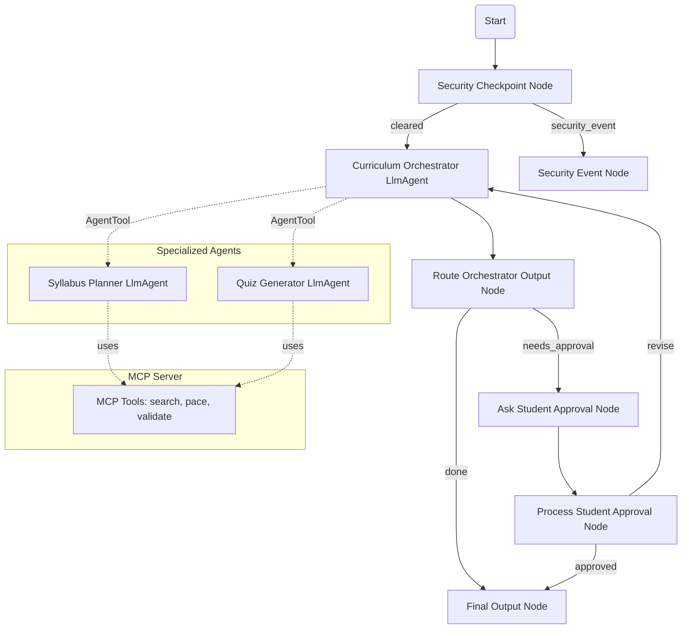

# Submission Write-Up: EduPath Agent

## Problem Statement

Underprivileged students worldwide face significant barriers in accessing high-quality, structured education. Private tutoring and custom syllabi are expensive, and navigating the vast sea of free internet resources (like Wikipedia, OpenStax, or Khan Academy) is overwhelming without guidance. 

The **EduPath Agent** solves this problem by providing a free, secure, and intelligent virtual learning coordinator. It automatically creates structured learning paths based on a student's available hours and academic level, recommends high-quality free learning materials, and administers interactive quizzes to test their knowledge.

## Solution Architecture

The agent is designed using a multi-agent orchestration architecture utilizing the **ADK 2.0 Workflow graph API**.

## Concepts Used

1. **ADK Workflow (Graph API):** Configured in [agent.py](file:///Users/gabrielnesaraj/adk-workspace/edupath-agent/app/agent.py#L225-L242), controlling the state transitions between security filters, orchestrator, approval checking, and output rendering.
2. **LlmAgent:** Implemented for the core intelligent roles (`orchestrator`, `syllabus_planner`, `quiz_generator`) in [agent.py](file:///Users/gabrielnesaraj/adk-workspace/edupath-agent/app/agent.py#L75-L121).
3. **AgentTool:** Wired into the orchestrator in [agent.py](file:///Users/gabrielnesaraj/adk-workspace/edupath-agent/app/agent.py#L120) to delegate syllabus and quiz planning to specialized agents.
4. **MCP Server:** Runs locally via Python-MCP stdio transport in [mcp_server.py](file:///Users/gabrielnesaraj/adk-workspace/edupath-agent/app/mcp_server.py).
5. **Security Checkpoint:** Implemented as a Graph node in [agent.py](file:///Users/gabrielnesaraj/adk-workspace/edupath-agent/app/agent.py#L136-L200) to validate user input before passing it to LLMs.
6. **Agents CLI:** Scaffolding, dependency synchronization (`make install`), and running the local UI playground (`make playground`).

## Security Design

To protect students and ensure safe, appropriate academic use:
* **PII Redaction:** A regular-expression filter inside `security_checkpoint` automatically redacts email addresses and phone numbers to prevent student data leakage.
* **Prompt Injection Defense:** Input is audited for jailbreaking and instruction override keywords. Violations route to a dedicated security event handler, completely bypassing the LLM.
* **Domain Content Filter:** Restricts requested subjects to safe, constructive educational topics. Attempts to learn harmful skills (like bomb making or hacking) are flagged and blocked.
* **Structured Audit Logging:** Every check produces a machine-readable JSON log printed to stdout containing timestamps, severity classifications (`INFO`/`WARNING`/`CRITICAL`), and detailed diagnostic messages.

## MCP Server Design

The local Model Context Protocol (MCP) server implements three core domain-specific tools:
1. `search_educational_resources`: Searches a structured database of verified free textbooks (e.g. OpenStax, Khan Academy) to suggest relevant learning materials.
2. `calculate_study_pace`: Standardizes milestones and total program duration depending on course difficulty and the hours/week the student commits.
3. `validate_quiz_answers`: Grades multiple-choice quizzes, calculates score percentages, and returns customized encouraging feedback and review advice.

## Human-in-the-Loop (HITL) Flow

When a custom curriculum is generated, it is vital that the student has the final say in approving the content. The workflow uses `RequestInput` to pause execution at the `ask_student_approval` node. The playground UI displays the syllabus and asks: *"Do you approve this custom study plan? (yes/no/changes)"*. 

* If the student replies `"yes"`, the workflow proceeds to finalize the approved plan.
* If the student requests edits (e.g. *"make it shorter"* or *"add more exercises"*), the workflow routes the feedback back into the orchestrator loop, regenerating the curriculum iteratively.

## Demo Walkthrough

The project supports three realistic demonstration flows:
1. **Syllabus Creation:** Requesting a 10-hour/week Python course for beginners returns a week-by-week syllabus pointing to free textbooks, and requests approval.
2. **Interactive Quizzing:** Requesting a quiz outputs a formatted set of questions.
3. **Safety Violations:** Requesting inappropriate topics (e.g., weapon building) triggers an instant blocker and prints a high-severity security audit log.

## Impact & Value Statement

The **EduPath Agent** democratizes access to personalized education. By turning the chaotic web of free internet resources into a cohesive, structured study path tailored to each student's availability, it provides high-quality educational mentorship to underprivileged learners, free of cost, in a safe and secure sandbox.
